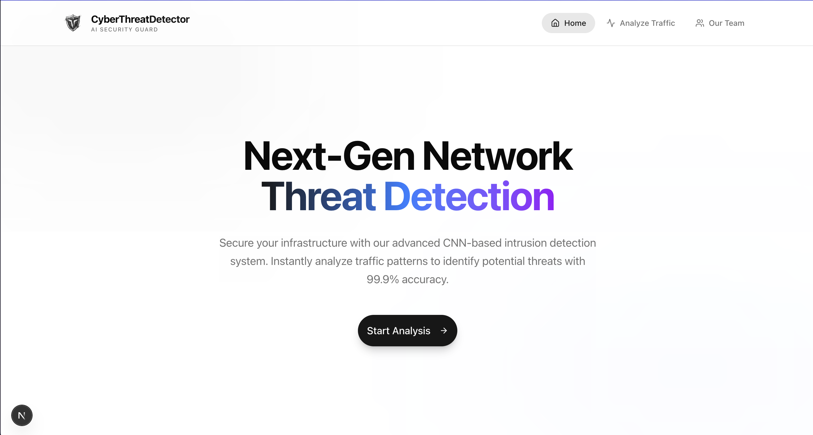
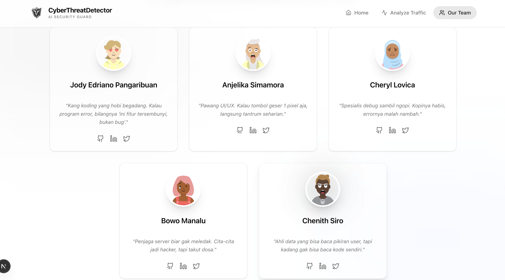

# 🛡️ CyberThreat Detector

CyberThreat Detector is a real-time network traffic analysis tool powered by Deep Learning. It uses a Convolutional Neural Network (CNN) to detect and classify various network threats such as DDoS, Ransomware, and Brute Force attacks.



## ✨ Features

-   **Real-time Traffic Analysis**: Capture and analyze live network packets from your machine.
-   **AI-Powered Detection**: Utilizes a trained CNN model to classify traffic with high accuracy.
-   **Interactive Dashboard**: Beautiful, responsive UI built with Next.js and Tailwind CSS.
-   **Detailed Insights**: View confidence scores, threat levels, and actionable advice.

## 🛠️ Tech Stack

-   **Frontend**: Next.js 14, React, Tailwind CSS, Framer Motion, Lucide Icons.
-   **Backend**: Flask (Python), TensorFlow/Keras, Scikit-learn, Scapy.
-   **Model**: Convolutional Neural Network (CNN) trained on the CyberFedDefender dataset.

---

## 🚀 Getting Started

Follow these steps to set up and run the project locally.

### Prerequisites

Ensure you have the following installed:
-   **Node.js** (v18 or higher)
-   **Python** (v3.9 or higher)
-   **Git**

### 1. Clone the Repository

```bash
git clone https://github.com/jodypangaribuan/cyber-threat-detector.git
cd cyber-threat-detector
```

### 2. Backend Setup (Python API)

The backend handles the machine learning model and packet sniffing.

1.  Navigate to the backend directory:
    ```bash
    cd backend
    ```

2.  Create a virtual environment:
    ```bash
    # macOS/Linux
    python3 -m venv venv
    
    # Windows
    python -m venv venv
    ```

3.  Activate the virtual environment:
    ```bash
    # macOS/Linux
    source venv/bin/activate
    
    # Windows
    venv\Scripts\activate
    ```

4.  Install dependencies:
    ```bash
    pip install -r requirements.txt
    ```
    *Note: If you encounter issues installing `scapy` or `tensorflow`, ensure your pip is up to date: `pip install --upgrade pip`.*

5.  Run the Flask server:
    ```bash
    python app.py
    ```
    The server will start on **http://localhost:5001**.

    > **⚠️ Important Note for Live Scanning**: 
    > To use the "Scan My Network" feature with full packet capture capabilities, you might need to run the backend with root/admin privileges (e.g., `sudo python app.py`). However, the app includes a smart fallback that works without root by analyzing your current connection metadata.

### 3. Frontend Setup (Next.js)

The frontend provides the user interface.

1.  Open a new terminal window and navigate to the project root (if you are in `backend`, go back one level):
    ```bash
    cd ..
    ```

2.  Install Node.js dependencies:
    ```bash
    npm install
    ```

3.  Run the development server:
    ```bash
    npm run dev
    ```

4.  Open your browser and visit:
    **http://localhost:3000**

---

## 📖 Usage Guide

1.  **Home Page**: Click "Start Analysis" to go to the dashboard.
2.  **Analysis Dashboard**:
    -   **Manual Entry**: You can manually input network parameters (Protocol, Packet Length, etc.) to test specific scenarios.
    -   **Live Scan**: Click the **"Scan My Network"** button. The system will capture a snapshot of your current network traffic, extract features, and feed them into the AI model.
3.  **Results**: The system will display the predicted class (Normal, DDoS, etc.), confidence score, and threat level.

## 🔧 Troubleshooting

-   **Port Conflicts**: 
    -   The backend runs on port `5001` (to avoid conflicts with macOS Control Center on port 5000).
    -   The frontend runs on port `3000`.
    -   If these ports are busy, you may need to kill the processes using them or change the ports in `app.py` and `package.json`.

-   **Scapy Permissions**:
    -   If you see "Permission denied" errors in the backend console when scanning, it means `scapy` couldn't access the network interface. The app handles this gracefully by falling back to connection-based analysis, so the feature will still work!

## 👥 Team

-   **Jody Edriano Pangaribuan**
-   **Anjelika Simamora**
-   **Cheryl Lovica**
-   **Bowo Manalu**
-   **Chenith Siro**


