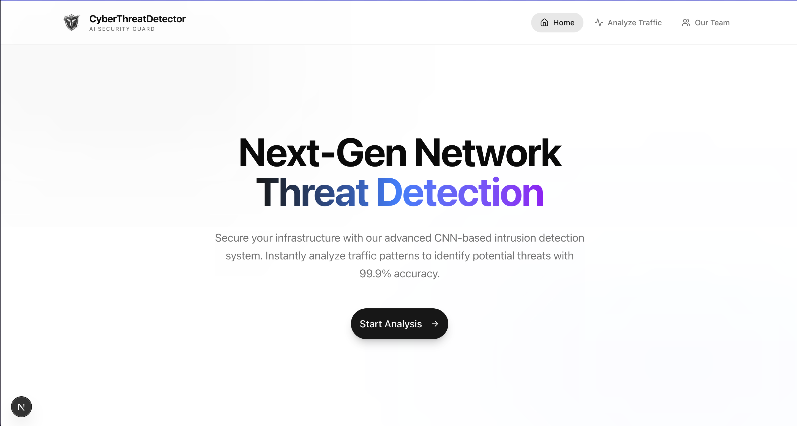
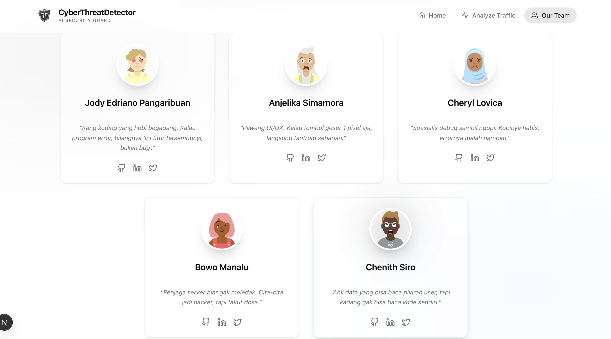

<div align="center">
  <h1>CyberThreat Detector</h1>
</div>

<div align="center">
  
  
  
</div>

<br />

<div align="center">
  
  
  
  
  
  
</div>

<br />

<p align="center">
  <strong>A real-time network traffic analysis tool powered by Deep Learning, designed to detect and classify various network threats.</strong>
</p>

<br />

<p align="center">
  
</p>

## Executive Summary

**CyberThreat Detector** is an advanced network security tool that provides a real-time network traffic analysis powered by Deep Learning. The platform utilizes a **Convolutional Neural Network (CNN)** to independently detect and classify various network threats such as DDoS, Ransomware, and Brute Force attacks. 

## Key Features

- **🌐 Real-time Traffic Analysis**: Capture and analyze live network packets from your machine securely.
- **🧠 AI-Powered Detection**: Utilizes a trained CNN model to classify network traffic with high accuracy and speed.
- **🖥️ Interactive Dashboard**: Enjoy a beautiful, responsive, and dynamic user interface built with Next.js and Tailwind CSS.
- **📊 Detailed Insights**: Access comprehensive information including model confidence scores, detailed threat levels, and intelligent, actionable advice.

---

## Tech Stack & Core Systems

| Category | Technology |
| --- | --- |
| **Frontend Web** | Next.js 14, React, Tailwind CSS, Framer Motion, Lucide Icons |
| **Backend API** | Python, Flask, Scapy |
| **Machine Learning** | TensorFlow/Keras, Scikit-learn, CNN (CyberFedDefender dataset) |

---

## Project Structure

This project adopts a clean structure separating the frontend interface and the AI-powered backend:

```text
cyber-threat-detector/
├── app/                   # Next.js App Router (Frontend Pages & Layouts)
├── components/            # Reusable UI Components (shadcn/ui, etc.)
├── backend/               # Python/Flask Backend API and Helper Scripts
│   ├── app.py             # Main Flask server entry point & network sniffer
│   ├── check_normal_stats.py # Utility script for checking normal stats
│   └── requirements.txt   # Python dependencies
├── public/                # Static application assets (images, icons)
│   ├── image.png          # Project banner / logo
│   └── all_team.png       # Team image
├── train.ipynb            # Jupyter Notebook for Training the CNN Model
├── model.h5               # Trained Artificial Neural Network/CNN Model File
├── cyberfeddefender_dataset.csv # The dataset used for model training
├── package.json           # Node.js dependencies and scripts
└── README.md              # Main project guide & documentation file
```

---

## How to Run the Application

The CyberThreat Detector application in this repository is divided into 2 main component directories (Frontend Web at root and Backend in `backend/`).

### System Prerequisites
Ensure your operating system has the following installed:
- [Node.js](https://nodejs.org/) (version 18 or higher)
- [Python](https://www.python.org/) (version 3.9 or higher)
- [Git](https://git-scm.com/)

---

### 1. Backend Setup (Python API)

The backend handles the machine learning model and packet sniffing.

1. Navigate to the backend directory:
   ```bash
   cd backend
   ```
2. Create a virtual environment:
   ```bash
   # macOS/Linux
   python3 -m venv venv
   
   # Windows
   python -m venv venv
   ```
3. Activate the virtual environment:
   ```bash
   # macOS/Linux
   source venv/bin/activate
   
   # Windows
   venv\Scripts\activate
   ```
4. Install dependencies:
   ```bash
   pip install -r requirements.txt
   ```
   *(Note: If you encounter issues installing `scapy` or `tensorflow`, ensure your pip is up to date: `pip install --upgrade pip`)*
5. Run the Flask server:
   ```bash
   python app.py
   ```
   The backend server will start on **http://localhost:5001**.

> **⚠️ Important Note for Live Scanning**: 
> To use the "Scan My Network" feature with full packet capture capabilities, you might need to run the backend with root/admin privileges (e.g., `sudo python app.py`). However, the app includes a smart fallback that works without root by analyzing your current connection metadata.

---

### 2. Frontend Setup (Next.js)

The frontend provides the interactive user interface.

1. Open a new terminal window and navigate to the project root:
   ```bash
   cd cyber-threat-detector
   ```
2. Install Node.js dependencies:
   ```bash
   npm install
   ```
3. Run the development server:
   ```bash
   npm run dev
   ```
4. Open your browser and visit: **http://localhost:3000**

---

## 📖 Usage Guide

1.  **Home Page**: Click "Start Analysis" to go to the dashboard.
2.  **Analysis Dashboard**:
    -   **Manual Entry**: You can manually input network parameters (Protocol, Packet Length, etc.) to test specific scenarios.
    -   **Live Scan**: Click the **"Scan My Network"** button. The system will capture a snapshot of your current network traffic, extract features, and feed them into the AI model.
3.  **Results**: The system will display the predicted class (Normal, DDoS, etc.), confidence score, and threat level.

## 🔧 Troubleshooting

-   **Port Conflicts**: 
    -   The backend runs on port `5001` (to avoid conflicts with macOS Control Center on port 5000).
    -   The frontend runs on port `3000`.
    -   If these ports are busy, you may need to kill the processes using them or change the ports in `app.py` and `package.json`.
-   **Scapy Permissions**:
    -   If you see "Permission denied" errors in the backend console when scanning, it means `scapy` couldn't access the network interface. The app handles this gracefully by falling back to connection-based analysis, so the feature will still work!

## Development Team

This platform was developed by:
- **Jody Edriano Pangaribuan**
- **Anjelika Simamora**
- **Cheryl Lovica**
- **Bowo Manalu**
- **Chenith Siro**

<p align="center">
  
</p>

<br />

> **License**: © 2026 CyberThreat Detector Team. All rights reserved.
